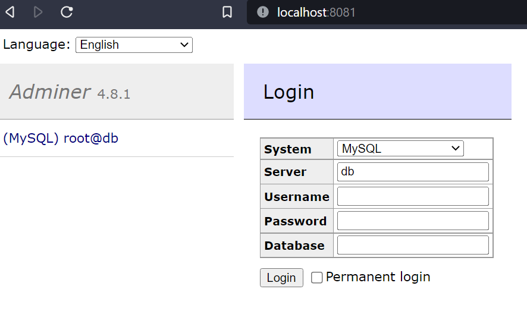

# Project Java with Spring Boot

## Description
This project is a MVC application with Spring Boot with call API.


## Getting Started


### Dependencies

* **JAVA** : 17 or higher


* **MAVEN**:
```
<dependency>
    <groupId>org.springframework.boot</groupId>
    <artifactId>spring-boot-starter-web</artifactId>
</dependency>
<dependency>
    <groupId>org.springframework.boot</groupId>
    <artifactId>spring-boot-starter-tomcat</artifactId>
    <scope>provided</scope>
    </dependency>
<dependency>
    <groupId>org.springframework.boot</groupId>
    <artifactId>spring-boot-starter-test</artifactId>
    <scope>test</scope>
</dependency>
<dependency>
    <groupId>org.springframework.boot</groupId>
    <artifactId>spring-boot-starter-data-jpa</artifactId>
</dependency>
<dependency>
    <groupId>mysql</groupId>
    <artifactId>mysql-connector-java</artifactId>
    <scope>runtime</scope>
</dependency>
<dependency>
    <groupId>io.springfox</groupId>
    <artifactId>springfox-boot-starter</artifactId>
    <version>3.0.0</version>
</dependency>
<dependency>
    <groupId>org.iban4j</groupId>
    <artifactId>iban4j</artifactId>
    <version>3.2.4-RELEASE</version>
</dependency>
<dependency>
    <groupId>org.springframework.boot</groupId>
    <artifactId>spring-boot-starter-webflux</artifactId>
</dependency>
<dependency>
    <groupId>org.projectlombok</groupId>
    <artifactId>lombok</artifactId>
    <scope>provided</scope>
</dependency>
<dependency>
    <groupId>org.mapstruct</groupId>
    <artifactId>mapstruct</artifactId>
    <version>1.5.3.Final</version>
</dependency>
<dependency>
    <groupId>org.springframework.boot</groupId>
    <artifactId>spring-boot-starter-validation</artifactId>
</dependency>
```
To install the database, you need to create a **database** with a file docker-compose and with viewer DDB (adminer) :
```
version: '3.3'
services:
  db:
    image: mysql:5.7
    restart: always
    environment:
      MYSQL_DATABASE: 'db'
      MYSQL_USER: 'rioc'
      MYSQL_PASSWORD: 'rioc'
      MYSQL_ROOT_PASSWORD: 'root'
    ports:
      - '3306:3306'
    volumes:
      - my-db:/var/lib/mysql
  adminer:
    image: adminer
    restart: always
    ports:
      - 8081:8080
volumes:
  my-db:
```
And run the following command to run it (in the same directory as the docker-compose.yml file):
```
docker-compose up -d
```
If, you want to check your database, you can go to the following link : http://localhost:8081/

Username:root
Password:root

When you have the database, you can run the project with your favorite IDE.
Before running the project, you need to run the following command to download the dependencies:
```
mvn clean install -DskipTests
```
(If you use Java SDK 17 or higher, you need to add the following line in the pom.xml file)
You have to change just the number of the java version.

<properties>
		<java.version>19</java.version>
	</properties>
<source>19</source> <!-- depending on your project -->
<target>19</target> <!-- depending on your project -->
```
The url of the swagger is : http://localhost:8080/swagger-ui/index.html#/


Explanation of the **Account** and **Bank** and **address** entities:
```
Account:
    - id
    - firstName
    - lastName
    - address (one to one)
    - bank (many to one relationship with Bank)
Bank:
    - id
    - name
    - iban
    - accounts (one to many relationship with Account)
Address:
    - id
    - street
    - city
    - country
```


Description of the **Account** Controller:
```
Requests: 
    - GET /accounts
    - GET /accounts/{id}
    - POST /accounts (when you create an account, your address is automatically checked with the API from the site https://api-adresse.data.gouv.fr/)
    - PUT /accounts/{id}
    - DELETE All /accounts
    - DELETE /accounts/{id}
    - UPDATE /accounts/{id}/
```
Description of the **Bank** Controller:
```
Requests:
    - GET /banks
    - GET /banks/{id}
    - POST /banks (when you create a bank, your iban is checked with the iban4j library)
    - PUT /banks/{id}  (when you update a bank, your iban is checked with the iban4j library)
    - DELETE /banks/{id} (when you delete a bank, all accounts associated with this bank are deleted)
```
Some info about the **Bank** Controller:

* The **iban** is checked with the iban4j library and crypt with the **AES** algorithm in the database.
* The **iban** is decrypted with the **AES** algorithm when you get a bank.

Some info about the **Account** Controller:


* The **address** is checked with the API from the site https://api-adresse.data.gouv.fr/
* When you create an account :
  * The **address** is checked with the API from the site https://api-adresse.data.gouv.fr/
  * Check the **id** is not already used
* When you delete an account :
  * Check the **id** is used
* When you update an account :
  * Check, if the **id** is used
  * Check, if the **address** is changed, the **address** is checked with the API from the site https://api-adresse.data.gouv.fr/
  * check, if the **FirstName** or **LastName** is changed
* When you create a bank :
  * Check the **id** is not already used
  * Check the **iban** is not already used
  * Check the **iban** is valid with the iban4j library
* When you delete a bank :
  * Check the **id** is used
* When you update a bank :
  * Check the **id** is used
  * Check, if the **iban** and **bank name** and **country code** and **bank code** are changed, and save it in the database


### Built With

* [Maven](https://maven.apache.org/) - Dependency Management
* [Docker](https://www.docker.com/) - Container for the database
* [Spring Boot](https://spring.io/projects/spring-boot) - Framework for the backend
* [Spring Data JPA](https://spring.io/projects/spring-data-jpa) - Framework for the database
* [Springfox](https://springfox.github.io/springfox/) - Framework for the API documentation
* [Lombok](https://projectlombok.org/) - Framework for the getters and setters
* [MapStruct](https://mapstruct.org/) - Framework for the mapping
* [Iban4j](https://github.com/arturmkrtchyan/iban4j) - Framework for the iban validation


### Authors

* **Alexandre LORNE** - *Initial work*

### License

This project is licensed under the MIT License - see the [LICENSE.md](LICENSE.md) file for details